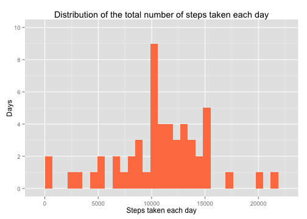
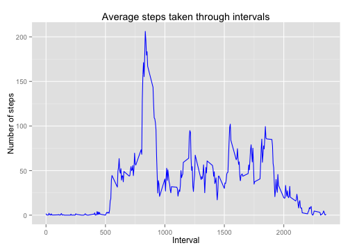
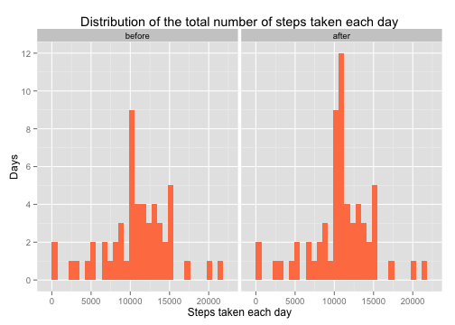
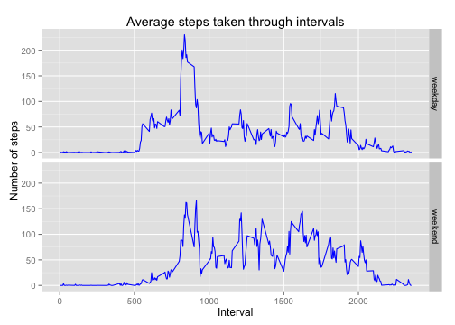

# Reproducible Research: Peer Assessment 1

It is now possible to collect a large amount of data about personal movement 
using activity monitoring devices such as a Fitbit, Nike Fuelband, or Jawbone 
Up. These type of devices are part of the “quantified self” movement – a group 
of enthusiasts who take measurements about themselves regularly to improve their 
health, to find patterns in their behavior, or because they are tech geeks. But 
these data remain under-utilized both because the raw data are hard to obtain 
and there is a lack of statistical methods and software for processing and 
interpreting the data.

This report makes use of data from a personal activity monitoring device. This 
device collects data at 5 minute intervals through out the day. The data 
consists of two months of data from an anonymous individual collected during the 
months of October and November, 2012 and include the number of steps taken in 5 
minute intervals each day.


## Loading and preprocessing the data
The original data is zipped in a file named "activity.zip". So the first step
is to unzip it and load it with the following code:

```r
zipfile <- "activity.zip"
rawdata <- read.csv(unz(zipfile, filename = "activity.csv"), colClasses = c(date = "Date"))
head(rawdata)
```

```
##   steps       date interval
## 1    NA 2012-10-01        0
## 2    NA 2012-10-01        5
## 3    NA 2012-10-01       10
## 4    NA 2012-10-01       15
## 5    NA 2012-10-01       20
## 6    NA 2012-10-01       25
```


## What is mean total number of steps taken per day?
To answer this question, we need to create a new dataset which aggregate total
steps taken per day:

```r
totalsum <- with(rawdata[!is.na(rawdata$steps), ], aggregate(steps, by = list(date), 
    FUN = "sum"))
names(totalsum) <- c("date", "steps")
head(totalsum)
```

```
##         date steps
## 1 2012-10-02   126
## 2 2012-10-03 11352
## 3 2012-10-04 12116
## 4 2012-10-05 13294
## 5 2012-10-06 15420
## 6 2012-10-07 11015
```

With this dataset, we can make a histogram plot to see its distribution:

```r
library(ggplot2)
g <- ggplot(totalsum, aes(x = steps))
g <- g + geom_histogram(fill = "coral")
g <- g + labs(title = "Distribution of the total number of steps taken each day")
g <- g + labs(x = "Steps taken each day", y = "Days")
g <- g + scale_y_continuous(limits = c(0, 10), breaks = seq(0, 10, by = 2))
print(g)
```

```
## stat_bin: binwidth defaulted to range/30. Use 'binwidth = x' to adjust this.
```

 

And we can calculate the mean and median total number of steps taken per day:

```r
cat("The mean total number of steps taken per day is : ", mean(totalsum$steps))
```

```
## The mean total number of steps taken per day is :  10766
```

```r
cat("The median total number of steps taken per day is : ", median(totalsum$steps))
```

```
## The median total number of steps taken per day is :  10765
```


## What is the average daily activity pattern?
To answer this question, we need to create a new dataset which aggregate average
steps taken in each interval:

```r
intervalaverage <- with(rawdata[!is.na(rawdata$steps), ], aggregate(steps, by = list(interval), 
    FUN = "mean"))
names(intervalaverage) <- c("interval", "avgsteps")
head(intervalaverage)
```

```
##   interval avgsteps
## 1        0  1.71698
## 2        5  0.33962
## 3       10  0.13208
## 4       15  0.15094
## 5       20  0.07547
## 6       25  2.09434
```

With this dataset, we can make a time series plot:

```r
library(ggplot2)
g <- ggplot(intervalaverage, aes(x = interval, y = avgsteps))
g <- g + geom_line(colour = "blue")
g <- g + labs(title = "Average steps taken through intervals")
g <- g + labs(x = "Interval", y = "Number of steps")
print(g)
```

 

And we can calculate which interval has the maximum step and what its value is:

```r
intervalmax <- intervalaverage[intervalaverage$avgsteps == max(intervalaverage$avgsteps), 
    ]
cat("The", intervalmax$interval, "5-minute interval has the maximum step : ", 
    intervalmax$avgsteps)
```

```
## The 835 5-minute interval has the maximum step :  206.2
```


## Imputing missing values
In this section, we will devise a strategy to fill in the missing values.
First, let's figure out how many rows with NAs in the dataset:

```r
naCount <- nrow(rawdata[is.na(rawdata$steps), ])
cat("The total number of rows with NAs in the dataset is : ", naCount)
```

```
## The total number of rows with NAs in the dataset is :  2304
```

Second, use a strategy to replace the missing values. Here we choose average 
steps taken in each interval to replace the NAs. So we use the dataset created
in Section 2 in this step:

```r
tmp <- merge(rawdata, intervalaverage, by = "interval", all.x = T)
tmp$steps[is.na(tmp$steps)] <- tmp$avgsteps[is.na(tmp$steps)]
```

And then subset a new dataset equal to original data with missing values filled:

```r
newData <- tmp[, c("date", "interval", "steps")]
nrow(newData)
```

```
## [1] 17568
```

```r
head(newData)
```

```
##         date interval steps
## 1 2012-10-01        0 1.717
## 2 2012-11-23        0 0.000
## 3 2012-10-28        0 0.000
## 4 2012-11-06        0 0.000
## 5 2012-11-24        0 0.000
## 6 2012-11-15        0 0.000
```

With this new dataset, do the analysis instruction in Section 1 again and 
contrast the results:

```r
# create new aggeregate dataset
totalsum2 <- with(newData, aggregate(steps, by = list(date), FUN = "sum"))
names(totalsum2) <- c("date", "steps")
contrast <- rbind(cbind(totalsum, flag = "before"), cbind(totalsum2, flag = "after"))
# draw histogram plot
library(ggplot2)
g <- ggplot(contrast, aes(x = steps))
g <- g + geom_histogram(fill = "coral") + facet_grid(. ~ flag)
g <- g + labs(title = "Distribution of the total number of steps taken each day")
g <- g + labs(x = "Steps taken each day", y = "Days")
g <- g + scale_y_continuous(limits = c(0, 12), breaks = seq(0, 12, by = 2))
print(g)
```

```
## stat_bin: binwidth defaulted to range/30. Use 'binwidth = x' to adjust this.
## stat_bin: binwidth defaulted to range/30. Use 'binwidth = x' to adjust this.
```

 

```r
# calculate mean and median
cat("The mean total number of steps taken per day: ", "\nbefore: ", mean(totalsum$steps), 
    "\nafter: ", mean(totalsum2$steps))
```

```
## The mean total number of steps taken per day:  
## before:  10766 
## after:  10766
```

```r
cat("The median total number of steps taken per day: ", "\nbefore: ", median(totalsum$steps), 
    "\nafter: ", median(totalsum2$steps))
```

```
## The median total number of steps taken per day:  
## before:  10765 
## after:  10766
```

It seems like the mean value keep the same, but median value has been changed a
little bit which would not cause a bias effect.

## Are there differences in activity patterns between weekdays and weekends?
To answer this question, we need to create a new dataset with a new variable to
indicate 'weekday' and 'weekend':

```r
tmp <- weekdays(newData$date)
weekday <- sapply(tmp, function(x) {
    if (x %in% c("Saturday", "Sunday")) 
        return("weekend") else return("weekday")
})
newData2 <- cbind(newData, weekday)
head(newData2)
```

```
##         date interval steps weekday
## 1 2012-10-01        0 1.717 weekday
## 2 2012-11-23        0 0.000 weekday
## 3 2012-10-28        0 0.000 weekend
## 4 2012-11-06        0 0.000 weekday
## 5 2012-11-24        0 0.000 weekend
## 6 2012-11-15        0 0.000 weekday
```

The create an aggeregate dataset by weekday and interval:

```r
intervalaverage2 <- with(newData2, aggregate(steps, by = list(weekday, interval), 
    FUN = "mean"))
names(intervalaverage2) <- c("weekday", "interval", "steps")
head(intervalaverage2)
```

```
##   weekday interval   steps
## 1 weekday        0 2.25115
## 2 weekend        0 0.21462
## 3 weekday        5 0.44528
## 4 weekend        5 0.04245
## 5 weekday       10 0.17317
## 6 weekend       10 0.01651
```

At last, draw a contrast plot by weekday and weekend:

```r
library(ggplot2)
g <- ggplot(intervalaverage2, aes(x = interval, y = steps))
g <- g + geom_line(colour = "blue") + facet_grid(weekday ~ .)
g <- g + labs(title = "Average steps taken through intervals")
g <- g + labs(x = "Interval", y = "Number of steps")
print(g)
```

 

